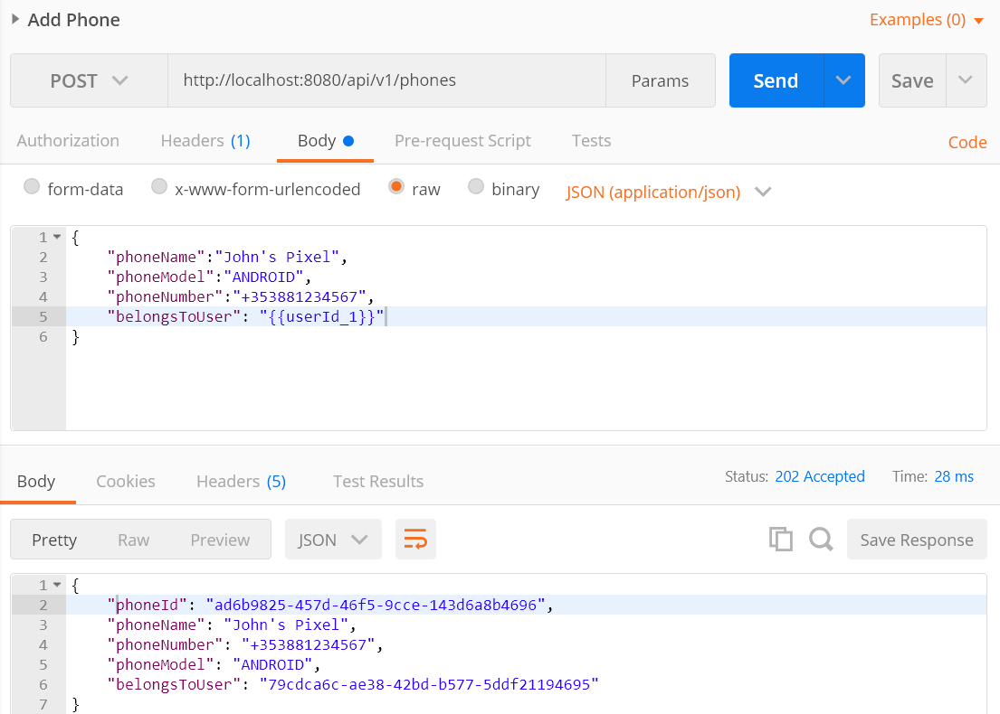
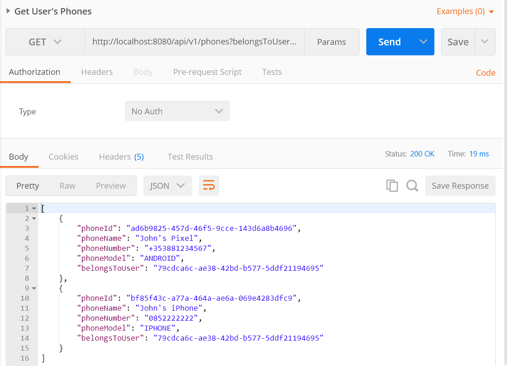

# phone-application
A basic user / phone management system, built with Java 11 and the Spring Framework.

### Running the Application

Prerequisites:
* Docker is installed on the machine you want to run the application on.

1. Save the contents of the *src\main\docker* directory to your machine.
2. In the same folder as the three files (the Dockerfile, docker-compose.yml and the project jar file), run `docker-compose up`.

You can also clone this repository and from the phone-application project root *(i.e. phone-application/phone-application, where the first is the repo and the second is the project)*, run `mvn clean install -DskipTests && cp target/*.jar src/main/docker/ && cd src/main/docker/ && docker-compose up`.

This will clean and build the project into a jar, copy the jar to the src/main/docker directory, and start the database and application.

### Technologies Used

* Java 11
* Docker: application and database are ran inside a container.
* Postgres
* Spring: starter-web used for the REST side of things, JPA library used for database functionality.

### Logging

I've added some logging into the controllers, just when requests come in or in case of any errors/problems (e.g. user or phone with ID not found).

### Testing

Testing included manual/exploratory testing in postman. The collection I used is saved under *src/test/resources/phone_application_postman_collection.json* along with screenshots. I've used global variables in the requests so they should run fine without any configuration.

Some screenshots below:

##### Add User

---

##### Update User's Preferred Number

---

##### Add Phone

---

##### Get User's Phones

---

### Could do with improvement:

* First and foremost there is no error handling in the application, other than returning not found for non-existant IDs. If a param is entered wrong the request will just fail.
* Would have liked to add in some contract testing or similar but I've already spent about 4(?) hours and want to keep to the time as much as possible.
* Would have liked to implement some sort of authentication, had looked at simple token implementations but just didn't have time in the end.
* The user-phone relationship in the database isn't really best practise. `phoneId` should really be a foreign key in the users table. Implementation does work as it is, had started looking at https://www.baeldung.com/hibernate-one-to-many but moved on to other requirements.
* On the subject of error handling, would have liked to create an error object of some sort with details of the error, just to present it to the user better.
* Doesn't currently accept '+' when updating phone number, due to handling at deserialisation: https://stackoverflow.com/questions/53361712/desserialization-of-plus-in-spring-request-param

---

#### Notes
For my own reference:

*Remove containers: docker rm -f $(docker ps -a -q)*

*Remove image: docker rmi phone-application*

*Remove volumes: docker volume prune*

`cd ../../../ && mvn clean install -DskipTests && cp target/*.jar src/main/docker/ && cd src/main/docker/ && docker-compose up --force-recreate`

#### Access Database
**Note:** Postgres container must be running.

`docker exec -it [postgres-container-id] psql -U postgres -W`

#### Reference Material

https://www.baeldung.com/spring-boot-postgresql-docker

https://www.baeldung.com/spring-data-partial-update

https://github.com/testcontainers/testcontainers-java/blob/master/modules/postgresql/src/test/java/org/testcontainers/junit/postgresql/SimplePostgreSQLTest.java

https://www.testcontainers.org/modules/databases/jdbc/

https://cloud.spring.io/spring-cloud-static/spring-cloud-contract/1.2.1.RELEASE/multi/multi__spring_cloud_contract_faq.html < for consumer/producer to handle UUID
